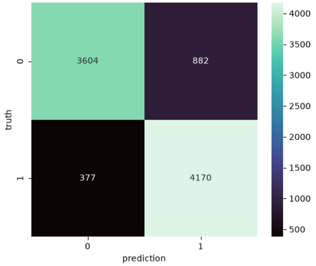
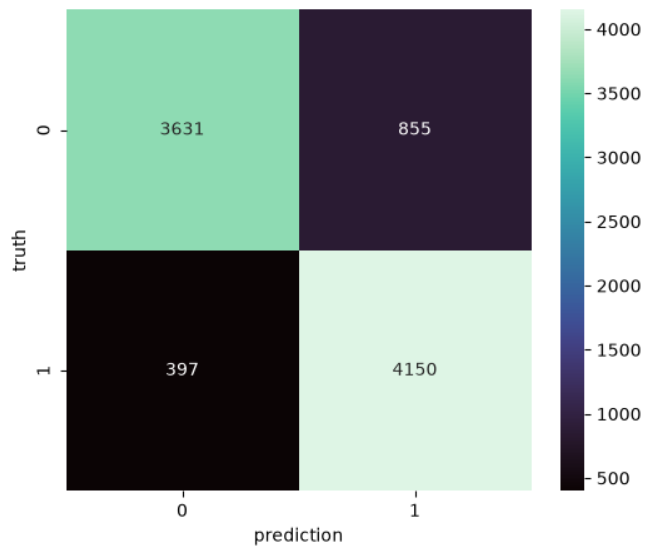

# Snapfood Sentiment Analysis

This project uses Machine Learning to classify Snapfood comments based on their sentiment.

## Model

The model used in this project is LinearSVC.

The text data was converted into numerical features using TfidfVectorizer.

The max_df parameter was changed in different experiments to compare the results.

---

## Experiment 1 - ngram = 6

In the first experiment, ngram was set to 6.

### Precision Score

- Accuracy: 0.8606221631794532
- Precision for each class: [0.90530018 0.82541568]


### Confusion Matrix


---

## Experiment 2 - max_df = 0.98

In the second experiment, max_df was set to 0.98.

### Precision Score

- Class 0: 0.00
- Class 1: 0.00
- Class 2: 0.00

### Confusion Matrix

!Confusion Matrix - max_df 0.98 (confusion_matrix_098.png)

---

## Experiment 3 - max_df = 0.99

In the third experiment, max_df was set to 0.99.

### Precision Score

- Accuracy: 0.8613970995239677
- Precision for each class: [0.90143992 0.82917083]

### Confusion Matrix



---


## Dataset

The project uses:

- snapfood_train.csv
- snapfood_test.csv

The main columns are:

- comment
- label

For the test data, the actual labels are stored as truth and the model predictions are stored as prediction.

---

## Evaluation

The model was evaluated using:

- Confusion Matrix
- Accuracy
- Precision

The Precision Score was calculated separately for each class.

---

## Libraries

```python
import pandas as pd

from sklearn.svm import LinearSVC
from sklearn.feature_extraction.text import TfidfVectorizer
from sklearn.metrics import confusion_matrix
from sklearn.metrics import accuracy_score
from sklearn.metrics import precision_score

import matplotlib.pyplot as plt
import seaborn as sns